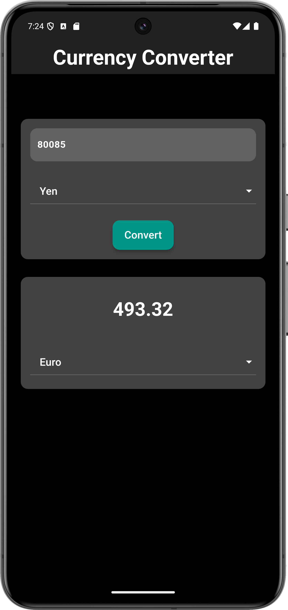

# Currency Converter App

## Overview

The Currency Converter App allows users to convert amounts between different currencies. It supports conversion rates to and from Indian Rupees (INR) and includes popular currencies such as USD, Yen, and Euro. The app features a clean and modern UI, and it supports both light and dark themes.

## Screenshots

Below are some screenshots of the app:

<table>
  <tr>
    <td>
      
      <br/>
    </td>
    <td>
      
      <br/>
    </td>
  </tr>
</table>

## Features

- Convert between multiple currencies.
- Modern and clean user interface.
- Easy-to-use dropdowns for currency selection.
- Responsive layout with scrollable view.

## Installation

To get started with the Currency Converter App, follow these steps:

1. **Clone the repository:**

   ```bash
   git clone https://github.com/your-username/your-repository.git
   ```

2. **Navigate to the project directory:**

   ```bash
   cd your-repository
   ```

3. **Install dependencies:**

   ```bash
   flutter pub get
   ```

4. **Run the app::**

   ```bash
   flutter run
   ```

## Usage

1. Open the app on your device or emulator.

2. Enter the amount you want to convert in the input field.

3. Select the currency you want to convert from and to using the dropdown menus.

4. Press the "Convert" button to see the converted amount displayed on the screen.
